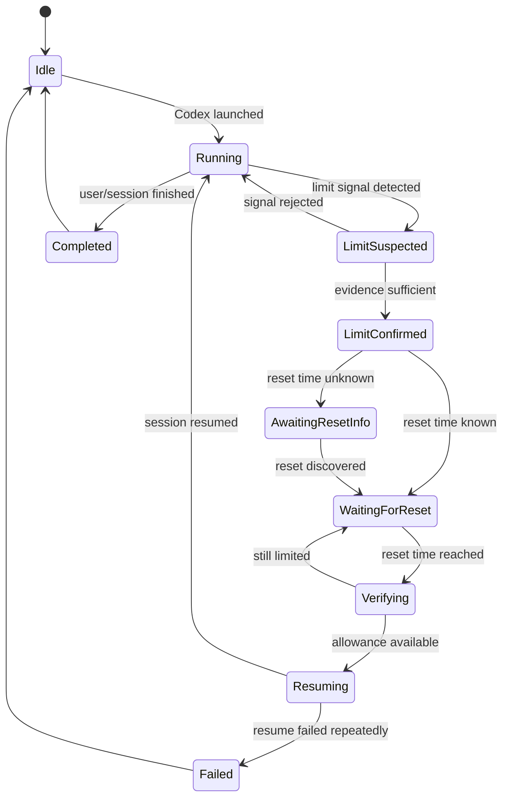

# Codex AutoResume — Complete Project Plan

> **Working name:** `codex-autoresume`  
> **Primary goal:** Automatically continue a Codex session **after an OpenAI usage limit has legitimately reset**, so the user does not need to return hours later just to press Continue / retry manually.
>
> **Phase 1:** Codex CLI / terminal  
> **Phase 2:** Codex desktop experience inside the ChatGPT desktop app

---

## 1. Executive Summary

`codex-autoresume` is a local utility that watches an active Codex session, detects when work has stopped because a Codex usage allowance has been exhausted, records the relevant session and reset information, waits locally until the allowance is available again, and resumes the **same saved Codex session**.

The project is intentionally **not** a rate-limit bypass. It must never attempt to spoof usage, rotate accounts, alter authentication, manipulate clocks, or send requests before OpenAI makes the account eligible again.

The core workflow is:

```text
User starts Codex
        ↓
AutoResume supervises session
        ↓
Codex reaches usage limit
        ↓
AutoResume identifies the blocked state
        ↓
Reset time is recorded
        ↓
State is persisted locally
        ↓
Wait until reset time
        ↓
Re-check eligibility
        ↓
Resume the same Codex session
        ↓
Continue the interrupted task
```

The project should be implemented as a **shared core engine** with separate adapters:

```text
                    ┌─────────────────────────┐
                    │    AutoResume Core      │
                    │                         │
                    │ state • timer • policy  │
                    │ persistence • logging   │
                    └───────────┬─────────────┘
                                │
                 ┌──────────────┴──────────────┐
                 │                             │
        ┌────────▼─────────┐          ┌────────▼─────────┐
        │ Phase 1          │          │ Phase 2          │
        │ Codex CLI        │          │ Desktop Codex    │
        │ adapter          │          │ adapter          │
        └──────────────────┘          └──────────────────┘
```

This prevents Phase 2 from becoming a separate application. Most of the timer, persistence, state-machine, logging, safety, and recovery logic should be reused.

---

# 2. Product Goals

## 2.1 Primary Goal

Allow a user to start Codex work and leave it unattended when a temporary usage limit is reached. When the allowance legitimately resets, AutoResume should continue the session without requiring the user to manually return only to press Continue or re-open the session.

## 2.2 Phase 1 Goal — Terminal Codex

The user should eventually be able to run:

```powershell
codex-autoresume
```

or a shorter alias such as:

```powershell
car
```

and then interact with Codex almost exactly as if they had run:

```powershell
codex
```

If a usage limit interrupts the workflow, AutoResume should persist enough information to resume the same session later.

## 2.3 Phase 2 Goal — Desktop Codex

Extend the same AutoResume engine to the Codex experience in the current ChatGPT desktop app.

Phase 2 should preferably integrate at the **Codex session/application layer**. UI automation should be a fallback rather than the first architectural choice.

## 2.4 Secondary Goals

- Show the current AutoResume state clearly.
- Show the known or estimated reset time.
- Persist state across AutoResume restarts.
- Recover safely after laptop sleep/reboot.
- Avoid accidental duplicate prompts.
- Preserve the Codex conversation/session.
- Work especially well on Windows + PowerShell.
- Keep all state local by default.
- Require no backend for V1.
- Produce useful logs for debugging.
- Be open-source friendly.

---

# 3. Non-Goals

The project must **not**:

- bypass Codex rate limits;
- use account rotation to avoid limits;
- automate creation of additional accounts;
- alter or forge authentication data;
- modify OpenAI usage counters;
- repeatedly hammer Codex before the reset;
- purchase credits or use a banked reset automatically without explicit user action;
- infer that every interruption is a usage-limit event;
- automatically approve security-sensitive tool actions;
- silently switch to `danger-full-access`;
- store ChatGPT/OpenAI credentials itself;
- reconstruct an entire Codex conversation if native session resume is available;
- depend on a hosted backend during the first two phases.

---

# 4. Current Codex Capabilities to Build Around

As of September 2026, the project can rely conceptually on several documented Codex capabilities:

- `codex` launches the interactive terminal UI.
- `codex resume` is a stable command for continuing saved interactive sessions.
- `codex resume --last` resumes the most recent session for the current working directory.
- A specific session can be resumed by session ID/name.
- `/resume` exists inside the Codex terminal interface.
- `/status` exposes session configuration and rate-limit information.
- Codex usage/reset information is also available through Settings / Usage.
- `/app` can continue the current Codex session in the desktop app on macOS/Windows.
- `codex app` can launch the desktop app.
- `codex exec --json` exists for structured non-interactive execution.
- `codex app-server` exists but is currently documented as experimental.

These capabilities are important because AutoResume should **reuse Codex's own session persistence** rather than inventing a parallel chat-history system.

---

# 5. Recommended Technology Stack

## 5.1 Primary Language

**TypeScript + Node.js**

Recommended because:

- Codex CLI itself fits naturally into a Node terminal ecosystem.
- `node-pty` provides a mature pseudo-terminal abstraction on Windows/macOS/Linux.
- npm distribution makes a CLI easy to install globally.
- TypeScript is useful for modeling states/events safely.
- Phase 2 can still call platform-specific helpers when necessary.

Example installation target:

```bash
npm install -g codex-autoresume
```

Then:

```bash
car
```

## 5.2 Core Dependencies

Potential dependencies:

```text
node-pty
commander
zod
chalk
ora (optional)
proper-lockfile
```

Optional later:

```text
electron-log
winax / PowerShell UIAutomation bridge / native helper
```

Avoid adding heavy dependencies unless they solve a real problem.

## 5.3 Local State

Start with a small JSON state file.

Suggested location:

```text
Windows:
%LOCALAPPDATA%\codex-autoresume\

macOS:
~/Library/Application Support/codex-autoresume/

Linux:
~/.local/state/codex-autoresume/
```

Example:

```text
codex-autoresume/
├── state.json
├── config.json
└── logs/
    └── 2026-09-26.log
```

SQLite can replace JSON later if multi-session supervision becomes necessary.

---

# 6. Shared Architecture

## 6.1 Components

```text
src/
├── cli/
│   ├── index.ts
│   └── commands.ts
│
├── core/
│   ├── state-machine.ts
│   ├── supervisor.ts
│   ├── scheduler.ts
│   ├── persistence.ts
│   ├── eligibility.ts
│   ├── deduplication.ts
│   └── events.ts
│
├── adapters/
│   ├── codex-cli/
│   │   ├── pty.ts
│   │   ├── detector.ts
│   │   ├── session.ts
│   │   └── status.ts
│   │
│   └── codex-desktop/
│       ├── desktop.ts
│       ├── accessibility.ts
│       ├── session-bridge.ts
│       └── detector.ts
│
├── platform/
│   ├── windows.ts
│   ├── macos.ts
│   └── sleep-resume.ts
│
├── config/
│   └── schema.ts
│
└── logging/
    └── logger.ts
```

---

# 7. State Machine

A state machine is essential because this tool must never blindly press/retry things.



## 7.1 Core States

### `IDLE`

No supervised Codex process.

### `RUNNING`

Codex is active and usable.

### `LIMIT_SUSPECTED`

A possible rate-limit signal was detected, but AutoResume has not yet decided that this is definitely a usage-limit event.

### `LIMIT_CONFIRMED`

The event has sufficient evidence.

### `AWAITING_RESET_INFO`

A limit is confirmed, but the reset timestamp has not yet been safely determined.

### `WAITING_FOR_RESET`

AutoResume has persisted the blocked session and is waiting.

### `VERIFYING`

The expected reset time has arrived and AutoResume is determining whether the account is usable again.

### `RESUMING`

The saved Codex session is being reopened/continued.

### `RUNNING_AFTER_RESUME`

Optional internal distinction for telemetry and deduplication.

### `FAILED`

AutoResume cannot safely resume automatically.

### `COMPLETED`

The supervised session ended normally.

---

# 8. Persisted Session Record

Example `state.json` entry:

```json
{
  "schemaVersion": 1,
  "status": "WAITING_FOR_RESET",
  "adapter": "codex-cli",
  "sessionId": "example-session-id",
  "sessionName": null,
  "workingDirectory": "C:\\CS\\project",
  "detectedAt": "2026-09-26T22:30:00+05:30",
  "resetAt": "2026-09-27T03:15:00+05:30",
  "lastVerifiedAt": null,
  "resumeAttempts": 0,
  "pendingAction": "resume-session",
  "interruptedTurn": {
    "known": false,
    "fingerprint": null
  }
}
```

Never persist:

- OAuth tokens;
- passwords;
- raw browser cookies;
- secrets from environment variables;
- full terminal history by default.

---

# 9. Reset-Time Strategy

Do **not** hard-code:

```text
now + 5 hours
```

The account may have different active allowances, weekly limits, credits, or reset behavior.

Use this precedence:

```text
1. Explicit reset timestamp supplied by Codex
2. Structured rate-limit/status data exposed by Codex
3. /status-derived reset information
4. Usage UI / adapter-specific supported information
5. Conservative polling when no reset timestamp is available
```

If a reset time is unknown, use conservative checks.

Example:

```text
first retry check: +15 min
then: every 30 min
maximum check frequency: low
```

AutoResume must not generate aggressive request traffic.

---

# 10. Phase 1 — Codex CLI / Terminal

## 10.1 Phase 1 Definition

Create a terminal wrapper that sits between the user and the Codex CLI.

Target UX:

```powershell
PS C:\CS\my-project> car
```

AutoResume launches Codex using a pseudo-terminal.

```text
PowerShell
   │
   ▼
codex-autoresume
   │
   ├── input passthrough
   ├── output passthrough
   ├── event detection
   ├── session tracking
   └── reset scheduler
          │
          ▼
        codex
```

To the user, it should still feel like normal Codex.

---

# 11. Phase 1 — PTY Wrapper

## 11.1 Why a PTY Is Needed

A normal subprocess pipe may break interactive terminal behavior.

Codex is an interactive TUI, so AutoResume should allocate a pseudo-terminal and forward:

```text
stdin  → Codex
Codex stdout/stderr → terminal
terminal resize → Codex PTY resize
Ctrl+C → appropriate child behavior
```

Recommended package:

```text
node-pty
```

## 11.2 Required Terminal Behaviors

The wrapper must preserve:

- ANSI colors;
- cursor movement;
- window resizing;
- keyboard input;
- Ctrl+C behavior;
- multiline input;
- paste;
- interactive menus;
- slash commands.

AutoResume must not corrupt the TUI.

---

# 12. Phase 1 — Detecting a Usage Limit

Detection should use **multiple signals**, not a single hard-coded sentence.

## 12.1 Signal Types

Possible signals:

### A. Known terminal message patterns

Examples conceptually include:

```text
usage limit reached
rate limit
reset at
try again after
allowance exhausted
```

The implementation should maintain a versioned pattern library.

### B. Codex status information

When safe, determine current allowance/reset information from supported Codex status mechanisms.

### C. Process behavior

Examples:

- current turn ends;
- Codex returns to an unusable prompt state;
- terminal output indicates a blocked allowance.

### D. Session metadata

Record the active session ID/name whenever available.

## 12.2 Evidence Scoring

Example:

```text
+5 explicit "usage limit reached"
+4 explicit reset timestamp
+3 Codex reports allowance exhausted
+2 expected blocked UI/state
-5 authentication failure
-5 network failure
-5 model/server outage
```

Confirm only when a threshold is reached.

This prevents errors such as treating:

```text
network timeout
HTTP 500
authentication expired
tool failure
Git error
```

as a usage limit.

---

# 13. Phase 1 — Session Identification

AutoResume must know **which Codex session** to reopen.

Preferred order:

```text
1. Explicit active session ID from supported Codex metadata/output
2. Saved session name/ID obtained from Codex's session inventory
3. `codex resume --last` scoped to the original working directory
```

Store:

```text
session ID
session name if available
working directory
launch arguments
model override if user supplied one
sandbox setting if user supplied one
```

Do **not** blindly resume `--last --all` unless the tool has verified that it refers to the intended session.

---

# 14. Phase 1 — What Does “Continue” Mean?

This needs a careful distinction.

There are two possible situations.

## Case A — Previous turn completed, next interaction is blocked

Then after reset:

```bash
codex resume <SESSION_ID>
```

may be sufficient.

AutoResume should reopen the session and leave it ready.

Optional user setting:

```text
auto-submit follow-up: ON
```

could submit a configured continuation instruction such as:

```text
Continue the task from where you stopped.
```

However, this should only happen if the user has enabled it.

## Case B — A turn was interrupted by the limit

The tool must avoid guessing whether the exact interrupted action needs to be replayed.

Preferred behavior:

1. Resume the native Codex session.
2. Let Codex retain its saved history/state.
3. If Codex exposes a supported retry/continue mechanism, invoke that.
4. Otherwise, send a minimal continuation prompt only when AutoResume has evidence that the previous turn did not finish.

Example:

```text
Continue the interrupted task from the current session state. Do not redo completed work.
```

The tool should never blindly replay a long original user prompt if that could duplicate file changes.

---

# 15. Duplicate-Work Protection

This is one of the most important features.

Before automatically sending a continuation prompt, create a fingerprint from:

```text
session ID
working directory
last known turn/event ID if available
timestamp
Git HEAD
Git working-tree status hash
```

After reset, compare the current state.

If the repository changed unexpectedly while AutoResume was waiting:

```text
AUTO CONTINUE PAUSED

Repository state changed while waiting.
Manual confirmation required.
```

Do not automatically re-run potentially destructive work.

---

# 16. Phase 1 — Waiting and Scheduling

## 16.1 Normal Case

```text
Limit at 22:10
Reset at 03:08
```

AutoResume persists:

```text
resetAt = 03:08
```

Then waits.

Do not rely exclusively on a single JavaScript `setTimeout()` lasting hours.

Use:

```text
persisted reset timestamp
+
periodic clock comparison
+
wake/resume handling
```

## 16.2 Laptop Sleep

If the laptop sleeps:

```text
03:08 reset occurs while asleep
06:50 laptop wakes
```

AutoResume should notice:

```text
current time > resetAt
```

and enter `VERIFYING` immediately.

## 16.3 Reboot

For the base MVP:

```text
car recover
```

should detect a persisted waiting session and resume supervision.

Later optional Windows integration:

```text
Windows Task Scheduler
```

could relaunch AutoResume after login or at/after the expected reset.

This should be opt-in.

---

# 17. Phase 1 — Verification Before Resume

Never assume:

```text
reset timestamp reached = definitely usable
```

At reset:

1. Wait a small configurable grace period, e.g. 30–60 seconds.
2. Check Codex availability using the least intrusive supported mechanism.
3. If still blocked:
   - record the new reset time if one is shown;
   - otherwise back off.
4. Resume only after the limit state is no longer present.

Example backoff:

```text
+1 min
+5 min
+15 min
+30 min
```

with a reasonable cap.

---

# 18. Phase 1 — CLI UX

Example:

```text
┌─ Codex AutoResume ──────────────────────────────┐
│ Session: 71f2...                                │
│ Project: C:\CS\state-relay                      │
│ AutoResume: ON                                  │
└─────────────────────────────────────────────────┘
```

During normal use, avoid noisy status output.

When a limit occurs:

```text
╭─ Codex AutoResume ──────────────────────────────╮
│ Codex usage limit detected                      │
│                                                │
│ Session saved        ✓                          │
│ Working directory    C:\CS\state-relay          │
│ Expected reset       03:08 AM                   │
│ Auto-resume          enabled                    │
│                                                │
│ You can leave this terminal open.               │
╰────────────────────────────────────────────────╯
```

When reset happens:

```text
[AutoResume] Reset window reached.
[AutoResume] Verifying Codex availability...
[AutoResume] Allowance available.
[AutoResume] Resuming session 71f2...
```

---

# 19. Phase 1 — Commands

Recommended command surface:

```bash
car
```

Launch supervised Codex.

```bash
car status
```

Show AutoResume state.

```bash
car recover
```

Recover persisted waiting/resume state.

```bash
car cancel
```

Cancel an automatic resume.

```bash
car logs
```

Show log location/recent events.

```bash
car doctor
```

Check:

```text
Node version
Codex installation
Codex version
authentication availability
PTY support
write permissions
state directory
desktop app availability
```

```bash
car config
```

Show current configuration.

Possible passthrough:

```bash
car -- --model <model> --sandbox workspace-write
```

Everything after `--` is forwarded to Codex.

---

# 20. Phase 1 — Configuration

Example `config.json`:

```json
{
  "enabled": true,
  "autoResume": true,
  "autoContinuePrompt": false,
  "continuePrompt": "Continue the interrupted task from the current session state. Do not redo completed work.",
  "gracePeriodSeconds": 45,
  "maxResumeAttempts": 5,
  "persistLogs": true,
  "logTerminalContent": false,
  "startOnLogin": false
}
```

Default:

```text
logTerminalContent = false
```

for privacy.

---

# 21. Phase 1 — Logging

Record operational metadata:

```text
timestamp
state transition
Codex process exit code
detected limit category
reset timestamp
session ID
resume attempts
errors
```

Do not log entire prompts/output by default.

Example:

```text
2026-09-26T22:14:04 LIMIT_SUSPECTED
2026-09-26T22:14:05 LIMIT_CONFIRMED
2026-09-26T22:14:05 resetAt=2026-09-27T03:08:00+05:30
2026-09-27T03:08:45 VERIFYING
2026-09-27T03:08:47 RESUMING session=71f2...
2026-09-27T03:08:51 RUNNING
```

---

# 22. Phase 1 — Security Model

AutoResume should run Codex with the **same permissions the user requested**.

It must never change:

```text
sandbox mode
approval policy
workspace permissions
```

simply to make resumption easier.

If Codex was launched with:

```text
workspace-write
```

resume with the same policy where possible.

If a command requires an interactive approval after resume, AutoResume should **not approve it automatically**.

The user can return later to approve the action.

---

# 23. Phase 1 — Failure Cases

Handle explicitly:

## Authentication Expired

```text
Login required.
AutoResume paused.
```

Do not try to steal/recreate credentials.

## No Session Found

Do not resume some unrelated `--last` session.

```text
Expected session could not be found.
Manual recovery required.
```

## Codex Updated

Run compatibility detection.

If known output parsing no longer matches:

```text
Limit state could not be verified safely.
Automatic resume disabled for this event.
```

## Network Offline

Back off without treating it as a quota failure.

## OpenAI Service Issue

Do not treat it as a rate-limit reset.

## Weekly Limit Still Active

If the five-hour window reset but another allowance remains exhausted, stay in waiting state using the newly reported reset information.

## User Manually Resumed Elsewhere

If the session has already progressed:

```text
Session activity detected.
AutoResume will not send a duplicate continuation.
```

---

# 24. Phase 1 — Tests

## 24.1 Unit Tests

Test:

- timestamp parsing;
- timezone handling;
- state transitions;
- retry backoff;
- output-pattern matching;
- false-positive rejection;
- session-record serialization;
- duplicate-work fingerprinting;
- corrupt-state recovery.

## 24.2 PTY Integration Tests

Use a fake Codex process.

Fixtures:

```text
normal-session.txt
five-hour-limit.txt
weekly-limit.txt
auth-error.txt
network-error.txt
server-error.txt
reset-time-changed.txt
```

Fake sequence:

```text
Running...
Usage allowance exhausted.
Reset at 03:08.
```

Verify AutoResume moves:

```text
RUNNING
→ LIMIT_SUSPECTED
→ LIMIT_CONFIRMED
→ WAITING_FOR_RESET
```

## 24.3 Resume Integration Test

Mock:

```bash
codex resume TEST_SESSION
```

and assert exactly one invocation.

## 24.4 Real Manual Tests

Test on:

```text
Windows 11 PowerShell
Windows Terminal
CMD optional
WSL later
```

---

# 25. Phase 1 — Acceptance Criteria

Phase 1 is complete when:

- [ ] `car` launches the real Codex CLI interactively.
- [ ] Normal Codex terminal behavior remains usable.
- [ ] AutoResume can distinguish a simulated usage limit from network/auth failures.
- [ ] It records the intended Codex session.
- [ ] It records a real reset time when exposed.
- [ ] State survives AutoResume restart.
- [ ] Sleep/wake does not lose the timer.
- [ ] It resumes the intended session after reset.
- [ ] It never resumes before the reset is verified.
- [ ] It does not duplicate continuation prompts.
- [ ] It never changes Codex permissions automatically.
- [ ] `car status`, `recover`, `cancel`, and `doctor` work.
- [ ] Logs contain enough information to debug failures without storing full chats by default.

---

# 26. Phase 1 — Implementation Milestones

## Milestone 1 — Skeleton

Build:

```text
CLI command
config
logging
state storage
state machine
```

No Codex interaction yet.

## Milestone 2 — Codex Passthrough

Implement:

```text
node-pty
Codex launch
input forwarding
output forwarding
terminal resize
process shutdown
```

Goal:

```text
car
```

feels essentially like:

```text
codex
```

## Milestone 3 — Detector

Implement:

```text
output normalizer
limit signals
false-positive rejection
reset timestamp parser
```

## Milestone 4 — Session Tracking

Capture enough metadata to safely call:

```bash
codex resume <session>
```

or a verified:

```bash
codex resume --last
```

## Milestone 5 — Scheduler

Implement:

```text
persisted wait
sleep/wake recovery
grace period
backoff
```

## Milestone 6 — Auto Resume

Connect:

```text
WAITING
→ VERIFY
→ RESUME
→ RUNNING
```

## Milestone 7 — Recovery UX

Implement:

```text
car status
car recover
car cancel
car doctor
```

## Milestone 8 — Hardening

Add:

```text
deduplication
Git-state fingerprint
version compatibility
tests
```

## Milestone 9 — Packaging

Publish:

```text
npm package
GitHub README
MIT/Apache-2.0 license
release binaries later if useful
```

---

# 27. Phase 2 — Desktop Codex

## 27.1 Current Product Context

The Codex desktop experience is now part of the newer **ChatGPT desktop app** on macOS and Windows.

The project may still refer to the feature as:

```text
Desktop Codex
```

but implementation documentation should make clear that Phase 2 targets **Codex inside the ChatGPT desktop app**, rather than assuming a permanently separate Codex application.

---

# 28. Phase 2 Strategy

Do not begin Phase 2 by hard-coding screen coordinates.

Use this priority:

```text
1. Native Codex session / command integration
2. Supported local app/session interfaces
3. Accessibility/UI Automation
4. Pixel/mouse automation only as a last-resort prototype
```

Pixel clicking is too brittle for a real release.

---

# 29. Phase 2 Architecture

```text
                    AutoResume Core
                          │
                ┌─────────┴─────────┐
                │                   │
        CLI Adapter           Desktop Adapter
                                   │
                       ┌───────────┴───────────┐
                       │                       │
                Session Bridge          UI Accessibility
                       │                       │
                 Codex session          ChatGPT desktop
                 operations             Codex controls
```

Reuse from Phase 1:

```text
state machine
persistence
scheduler
limit representation
retry/backoff
logging
deduplication
config
security rules
```

Only replace the surface-specific adapter.

---

# 30. Phase 2 Preferred Path — Session Bridge

Codex documentation currently supports moving an active CLI session to desktop with:

```text
/app
```

and provides:

```bash
codex app
```

for opening the desktop application.

This suggests the CLI and desktop surfaces share enough Codex session concepts that Phase 2 should investigate native session bridging before using UI automation.

Research tasks:

- Determine how a desktop Codex chat identifies its saved session.
- Determine whether that same session can be resumed through documented CLI commands.
- Determine whether desktop sessions appear in the same local session inventory.
- Determine whether `codex app` can open a specific saved session/workspace.
- Evaluate whether the app can be opened after the reset with the intended session already selected.
- Evaluate whether a supported app command/API can submit a continuation action.

If session-level integration can perform the entire operation, **do not automate the UI at all**.

---

# 31. Phase 2 Optional Path — Codex App Server

`codex app-server` is documented but experimental.

Therefore:

```text
Do not make V1 Phase 2 depend exclusively on it.
```

Create an interface such as:

```ts
interface DesktopSessionBridge {
  locateSession(): Promise<SessionRef | null>;
  getLimitState(): Promise<LimitState>;
  openSession(session: SessionRef): Promise<void>;
  continueSession(session: SessionRef): Promise<ResumeResult>;
}
```

Then app-server support can be one implementation.

If the experimental API changes, the UI-accessibility fallback still works.

---

# 32. Phase 2 Fallback — Windows UI Automation

Because the primary user environment is Windows, the first desktop fallback should use **Microsoft UI Automation / accessibility semantics**.

Do not implement:

```text
click x=1421 y=902
```

Instead locate controls by semantic properties such as:

```text
window/process
role/control type
accessible name
enabled state
ancestor container
```

Conceptually:

```text
ChatGPT window
   ↓
Codex conversation
   ↓
usage-limit banner
   ↓
Continue / Retry control
```

Only interact if the expected structure is present.

---

# 33. Phase 2 Desktop Detection

A desktop limit is confirmed only when multiple conditions agree.

Example:

```text
Codex view active
AND
usage-limit banner visible
AND
matching allowance/reset text exists
AND
expected continuation control exists
```

After reset:

```text
same session
AND
limit no longer blocks execution
AND
continue/retry control is enabled
AND
action not previously submitted
```

Then perform one continuation action.

---

# 34. Phase 2 Guard Against Wrong Buttons

The desktop app may contain other controls called:

```text
Continue
Retry
Resume
```

Never search the whole application and press the first matching label.

Require a scoped selector:

```text
Codex session container
    └── limit-state container
            └── expected action control
```

Additional conditions:

```text
correct app process
correct chat/session
correct Codex view
expected reset has passed
control enabled
no duplicate action marker
```

---

# 35. Phase 2 — App Closed

If the reset happens while the desktop app is closed:

1. AutoResume reaches the reset window.
2. Verify the waiting session is still valid.
3. Launch ChatGPT desktop / Codex using a supported mechanism.
4. Open the correct workspace/session.
5. Verify the limit is cleared.
6. Continue once.

Do not launch random sessions based only on recency.

---

# 36. Phase 2 — Laptop Reboot

Optional Windows integration becomes more useful in Phase 2.

Possible flow:

```text
Limit detected
↓
State saved
↓
Task Scheduler entry created
↓
PC shuts down
↓
PC starts later
↓
AutoResume starts
↓
Reads state
↓
If reset already passed → verify
↓
Open correct desktop Codex session
```

Task Scheduler integration must be user-enabled.

---

# 37. Phase 2 — Tray Application

Phase 2 can add a lightweight tray companion.

Example:

```text
Codex AutoResume
────────────────
Status: Waiting
Reset: 03:08 AM
Session: state-relay
Surface: Desktop Codex

[Open Codex]
[Resume now]
[Cancel AutoResume]
[View logs]
```

`Resume now` must still respect current limit availability. It means "check now", not "bypass the limit".

---

# 38. Phase 2 — Notifications

Optional local notifications:

```text
Codex limit reached.
AutoResume scheduled for 03:08 AM.
```

Then:

```text
Codex session resumed successfully.
```

Or:

```text
AutoResume needs your attention:
authentication expired.
```

Notifications should be optional.

---

# 39. Phase 2 — Acceptance Criteria

Phase 2 is complete when:

- [ ] Desktop Codex sessions can be uniquely identified.
- [ ] A usage-limit state can be detected without relying only on pixel positions.
- [ ] Reset time/state feeds the shared scheduler.
- [ ] The correct desktop session can be reopened after reset.
- [ ] AutoResume performs at most one continuation action.
- [ ] Wrong Continue/Retry buttons are not clicked.
- [ ] App restarts do not lose pending AutoResume state.
- [ ] Laptop sleep/restart is handled.
- [ ] Authentication failures stop safely.
- [ ] Desktop UI updates do not cause unsafe blind clicking.
- [ ] Phase 1 and Phase 2 share the same core state engine.

---

# 40. Phase 2 — Implementation Milestones

## Milestone D1 — Desktop Discovery

Document:

```text
window/process identity
session identity
local session relationship
desktop command behavior
```

## Milestone D2 — Session Bridge Prototype

Attempt to open a known session using supported Codex mechanisms.

## Milestone D3 — Limit Detection

Implement desktop state reading.

Preferred:

```text
native/session state
```

Fallback:

```text
accessibility tree
```

## Milestone D4 — Safe Continue

Implement a single idempotent continuation action.

## Milestone D5 — Launch/Recovery

Support app closed/reopened scenarios.

## Milestone D6 — Tray UX

Add status and controls.

## Milestone D7 — Hardening

Test against:

```text
different window sizes
light/dark theme
app updates
multiple Codex chats
multiple repositories
screen lock
sleep/wake
```

---

# 41. Shared Safety Rules

These rules apply to both phases.

## Rule 1

Never attempt to continue before the account is legitimately usable again.

## Rule 2

Never manipulate authentication to work around the allowance.

## Rule 3

Never switch accounts automatically.

## Rule 4

Never purchase credits or consume a banked reset automatically.

## Rule 5

Never approve a sensitive Codex tool action merely because the user is absent.

## Rule 6

Never resume a session if its identity is ambiguous.

## Rule 7

Never send the same continuation action twice.

## Rule 8

If uncertain:

```text
stop and require user attention
```

rather than guessing.

---

# 42. Event Model

Suggested internal events:

```ts
type AutoResumeEvent =
  | { type: "CODEX_STARTED" }
  | { type: "SESSION_IDENTIFIED"; sessionId: string }
  | { type: "LIMIT_SIGNAL"; rawType: string }
  | { type: "LIMIT_CONFIRMED"; resetAt?: string }
  | { type: "RESET_INFO_UPDATED"; resetAt: string }
  | { type: "WAIT_STARTED" }
  | { type: "CLOCK_REACHED_RESET" }
  | { type: "ELIGIBILITY_CONFIRMED" }
  | { type: "STILL_LIMITED"; resetAt?: string }
  | { type: "RESUME_STARTED" }
  | { type: "RESUME_SUCCEEDED" }
  | { type: "RESUME_FAILED"; reason: string }
  | { type: "USER_CANCELLED" };
```

This keeps CLI and desktop behavior consistent.

---

# 43. Adapter Interface

```ts
interface CodexAdapter {
  start(): Promise<void>;

  identifySession(): Promise<SessionRef | null>;

  inspectUsageState(): Promise<UsageState>;

  waitForSurfaceEvent(
    callback: (event: SurfaceEvent) => void
  ): Promise<void>;

  resumeSession(
    session: SessionRef
  ): Promise<ResumeResult>;

  shutdown(): Promise<void>;
}
```

Implement:

```text
CodexCliAdapter
CodexDesktopAdapter
```

---

# 44. Usage-State Model

```ts
type UsageState =
  | {
      status: "AVAILABLE";
    }
  | {
      status: "LIMITED";
      limitType: "WINDOW" | "WEEKLY" | "OTHER" | "UNKNOWN";
      resetAt?: Date;
    }
  | {
      status: "UNKNOWN";
      reason: string;
    };
```

Do not equate:

```text
UNKNOWN
```

with:

```text
AVAILABLE
```

---

# 45. Retry Policy

Example:

```text
attempt 1: at expected reset + 45 sec
attempt 2: +2 min
attempt 3: +5 min
attempt 4: +15 min
attempt 5: +30 min
```

If Codex supplies a new reset timestamp, replace the retry schedule with that timestamp.

After maximum attempts:

```text
FAILED_REQUIRES_USER
```

---

# 46. Crash Recovery

Write state atomically:

```text
state.json.tmp
→ fsync
→ rename state.json
```

Use a process lock to prevent two AutoResume instances from supervising the same session.

On launch:

```text
if persisted state == WAITING_FOR_RESET:
    offer/perform recovery according to config

if persisted state == RESUMING:
    check session activity before retrying

if stale lock:
    safely clear after verification
```

---

# 47. Multi-Session Support — Later

Do not implement this in the first MVP unless necessary.

Future model:

```text
Session A → reset 03:08
Session B → available
Session C → weekly limit
```

Use SQLite when this becomes necessary.

Initial release should prioritize **one supervised active session**.

---

# 48. Privacy

Default privacy posture:

```text
Prompts stored?                 NO
Full assistant outputs stored? NO
OAuth tokens stored?           NO
Terminal transcript logs?      NO
Session ID stored?             YES
Working directory stored?      YES
Reset timestamp stored?        YES
Operational events stored?     YES
```

Provide:

```bash
car purge
```

to clear AutoResume's local data.

Do not delete Codex's own saved sessions.

---

# 49. Version Compatibility

Record:

```text
AutoResume version
Codex CLI version
OS
adapter version
```

Example:

```json
{
  "autoresume": "0.1.0",
  "codex": "0.x.x",
  "platform": "win32"
}
```

Use a compatibility layer for limit-pattern parsing.

If an unknown Codex version changes behavior, prefer disabling automatic submission while still preserving the timer/session data.

---

# 50. Recommended Repository Structure

```text
codex-autoresume/
├── README.md
├── LICENSE
├── package.json
├── tsconfig.json
├── src/
│   ├── index.ts
│   ├── cli/
│   ├── core/
│   ├── adapters/
│   │   ├── codex-cli/
│   │   └── codex-desktop/
│   ├── platform/
│   ├── config/
│   └── logging/
├── tests/
│   ├── unit/
│   ├── integration/
│   └── fixtures/
├── docs/
│   ├── architecture.md
│   ├── phase-1-cli.md
│   ├── phase-2-desktop.md
│   └── troubleshooting.md
└── scripts/
```

---

# 51. README Positioning

Suggested one-line description:

> **Codex AutoResume watches a Codex session and safely resumes it after an exhausted usage allowance becomes available again.**

Important README wording:

> AutoResume does not bypass, extend, spoof, or evade Codex usage limits. It waits for the allowance exposed by Codex/OpenAI to become available and then automates normal session resumption.

---

# 52. Development Order

Build in this exact order:

```text
1. Core state machine
2. Persistence
3. CLI skeleton
4. PTY passthrough
5. Fake Codex test harness
6. Limit detector
7. Reset parser
8. Session identification
9. Scheduler
10. Resume implementation
11. Deduplication
12. Sleep/restart recovery
13. Phase 1 release
14. Desktop session research
15. Desktop adapter
16. Accessibility fallback
17. Tray UX
18. Phase 2 release
```

Do **not** start desktop automation before Phase 1's core is stable.

---

# 53. Suggested Releases

## `v0.0.1` — PTY Proof of Concept

```text
car launches Codex
input/output passthrough
```

## `v0.1.0` — Limit Watcher

```text
detect simulated limit
parse reset
persist state
```

## `v0.2.0` — CLI AutoResume

```text
resume saved Codex session after verified reset
```

This is the first genuinely useful version.

## `v0.3.0` — Recovery

```text
sleep/wake
restart
doctor
cancel
logs
```

## `v0.5.0` — Hardened Phase 1

```text
Windows production-ready CLI
```

## `v0.6.0` — Desktop Experimental

```text
desktop session discovery
```

## `v0.8.0` — Desktop AutoResume Beta

```text
session bridge + accessibility fallback
```

## `v1.0.0`

```text
CLI stable
Desktop stable enough for normal use
documented safety guarantees
tested recovery
```

---

# 54. Phase 1 MVP Scope

To avoid overbuilding, the first useful MVP should contain only:

```text
✓ `car` wrapper
✓ Codex PTY passthrough
✓ one active session
✓ usage-limit detection
✓ reset-time parsing
✓ local persisted state
✓ safe wait
✓ resume correct session
✓ no automatic security approvals
✓ logs
✓ `status`
✓ `cancel`
```

Leave these for later:

```text
desktop app
tray icon
notifications
multi-session
cloud sync
mobile control
web dashboard
analytics
```

---

# 55. Phase 2 MVP Scope

The first desktop MVP should contain only:

```text
✓ detect one blocked desktop Codex session
✓ identify session
✓ feed reset into shared scheduler
✓ reopen correct Codex chat
✓ verify eligibility
✓ perform one safe continue action
✓ prevent duplicates
```

Do not initially add:

```text
multi-chat orchestration
remote phone control
cloud service
browser automation
```

---

# 56. Key Technical Risks

## Risk 1 — CLI Output Changes

Mitigation:

```text
adapter abstraction
pattern tests
version logging
structured Codex mechanisms where possible
```

## Risk 2 — Session Not Saved

Mitigation:

```text
confirm session identity before waiting
verify it is resumable
fallback to safe manual recovery
```

## Risk 3 — Laptop Sleeps

Mitigation:

```text
persist timestamps
clock reconciliation on wake
optional OS scheduler later
```

## Risk 4 — Desktop UI Changes

Mitigation:

```text
native session bridge first
accessibility selectors second
never rely on coordinates
```

## Risk 5 — Duplicate Work

Mitigation:

```text
idempotency record
Git fingerprint
session activity check
at-most-once continuation
```

## Risk 6 — Multiple Limits

Mitigation:

```text
model usage state explicitly
always trust newly reported reset information over old assumptions
```

---

# 57. Definition of Done — Whole Project

The project is considered complete when a user can:

```text
1. Start Codex through AutoResume.
2. Work normally.
3. Reach an actual usage-limit interruption.
4. Leave the machine unattended.
5. Have AutoResume remember the correct Codex session.
6. Wait until the legitimate reset.
7. Verify availability.
8. Resume the same task/session exactly once.
9. See useful status/log information.
```

and the same core system can later perform the equivalent flow for Desktop Codex.

---

# 58. First Engineering Task

Start with a **fake Codex executable**, not the real service.

Create:

```text
tests/fake-codex.ts
```

It should simulate:

```text
normal interaction
limit reached
reset timestamp
process restart
resume success
authentication error
network error
```

Then build the entire AutoResume state machine against the fake process.

Only after the state machine behaves correctly should it be connected to the real Codex CLI.

This makes development much faster and prevents waiting for a real five-hour limit just to test the project.

---

# 59. First Real-World Prototype

The first prototype should prove only this:

```text
car
 ↓
real Codex opens
 ↓
terminal interaction works normally
 ↓
fake/manual limit event can trigger waiting
 ↓
session identifier is persisted
 ↓
timer expires
 ↓
same Codex session is resumed
```

Once this works, replace the fake/manual limit event with real detection.

---

# 60. Final Architecture

```text
                         CODEX AUTORESUME
                               │
                               ▼
                    ┌─────────────────────┐
                    │   Supervisor Core   │
                    ├─────────────────────┤
                    │ State Machine       │
                    │ Scheduler           │
                    │ Persistence         │
                    │ Deduplication       │
                    │ Safety Policy       │
                    │ Logging             │
                    └─────────┬───────────┘
                              │
             ┌────────────────┴────────────────┐
             │                                 │
             ▼                                 ▼
 ┌─────────────────────────┐       ┌─────────────────────────┐
 │ PHASE 1                 │       │ PHASE 2                 │
 │ Codex CLI Adapter       │       │ Desktop Codex Adapter   │
 ├─────────────────────────┤       ├─────────────────────────┤
 │ node-pty                │       │ Session bridge          │
 │ terminal passthrough    │       │ Desktop launcher        │
 │ limit detector          │       │ Accessibility fallback  │
 │ session resolver        │       │ Scoped continue action  │
 └─────────────┬───────────┘       └─────────────┬───────────┘
               │                                 │
               ▼                                 ▼
       ┌───────────────┐                ┌────────────────────┐
       │  Codex CLI    │                │ ChatGPT Desktop    │
       │               │                │ → Codex            │
       └───────────────┘                └────────────────────┘
```

---

# 61. Recommended Decision

Use:

```text
TypeScript
Node.js
node-pty
local JSON state
native Codex session resume
Windows-first development
```

Build **Phase 1 completely before Phase 2**.

The central design principle should be:

> **AutoResume should automate the waiting and normal resumption step, not reproduce or circumvent Codex itself.**

---

# 62. Official References Used for This Plan

These were current when this plan was drafted (September 2026):

- OpenAI Help — Using Codex with your ChatGPT plan  
  https://help.openai.com/en/articles/11369540-using-codex-with-your-chatgpt-plan

- ChatGPT Learn — Developer commands / Codex CLI command reference  
  https://learn.chatgpt.com/docs/developer-commands

- OpenAI Help — Moving to the new ChatGPT desktop app  
  https://help.openai.com/en/articles/20001276-moving-to-the-new-chatgpt-desktop-app

- OpenAI — Introducing the Codex app  
  https://openai.com/index/introducing-the-codex-app/

---

## Short Version

### Phase 1

```text
Wrap Codex CLI
→ watch terminal
→ detect usage limit
→ save session + reset
→ wait
→ verify allowance
→ `codex resume`
→ continue once
```

### Phase 2

```text
Reuse same core
→ detect Desktop Codex limit
→ identify correct saved chat
→ wait
→ reopen desktop/session
→ verify allowance
→ perform one scoped Continue/Retry action
```

That is the full intended product path.
